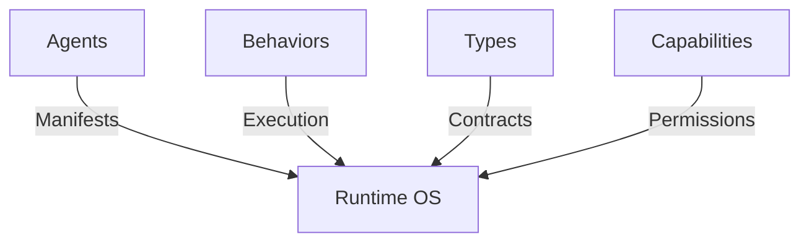

# The .agent Ecosystem

The .agent ecosystem is built on a clear division between declaration and implementation, enabling deterministic orchestration in a distributed environment.

## 1. Two Formats, One System

Agents are defined by two complementary files:

- **`.description` (The Manifest)**: The public contract. Defines what the agent is, what it consumes (input/requires), and what it exposes (output/capabilities). Enables instant indexing and capability enforcement by the Runtime without reading the behavior.
- **`.behavior` (The Implementation)**: The private logic. Defines the state machine, prompt orientation, and execution flow.

This separation is a **runtime guarantee**. The Runtime enforces the `capabilities` declared in the manifest against the actions executed in the behavior, providing a security sandbox.

## 2. The Runtime as Operating System

The Runtime acts as the OS, orchestrating agent lifecycle:
1. **Dependency Resolution**: Resolves `requires` blocks by locating and invoking provider agents.
2. **Validation**: Ensures data flowing between agents matches the explicit `type` contracts.
3. **Execution**: Interprets `.behavior` files and manages context memory domains.

## 3. .behavior vs .wasm

Both formats provide deterministic orchestration. The choice depends on **cognitive density**:

- **`.behavior`**: Human-readable, scannable DSL for structured workflows. A `.behavior` file should ideally remain scannable in **under 30 seconds**.
- **`.wasm`**: Compiled WebAssembly for high-density logic: loops, complex aggregations, transactional rollback, high-performance math, or IP-protected (opaque) logic.

| Use `.behavior` when... | Use `.wasm` when... |
|---|---|
| Workflow is structured and scannable | You need loops or recursion |
| AI can easily generate the flow | Complex data transformations are required |
| Transparency is prioritized | Transactional rollback across operations is needed |
| No complex math is required | Logic must remain opaque (IP protection) |
